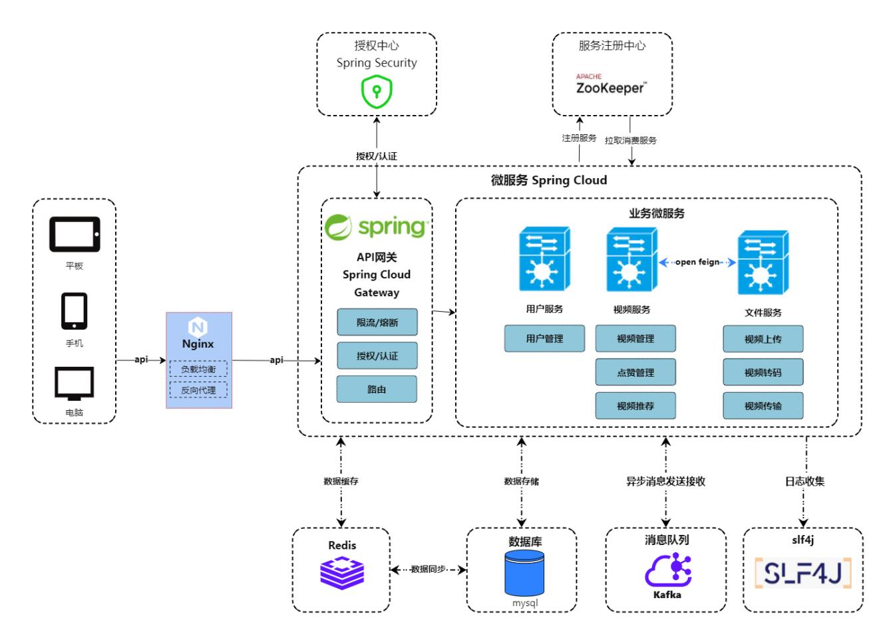
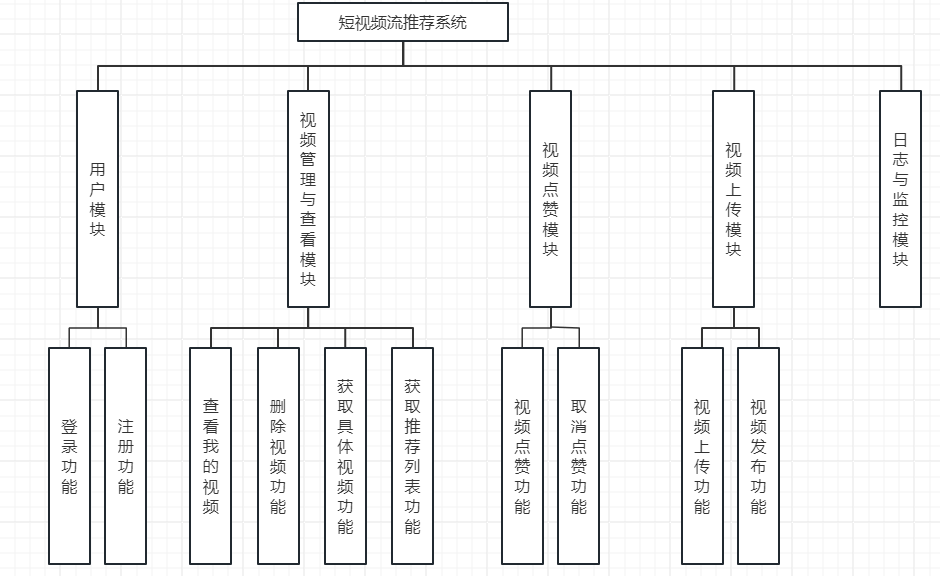
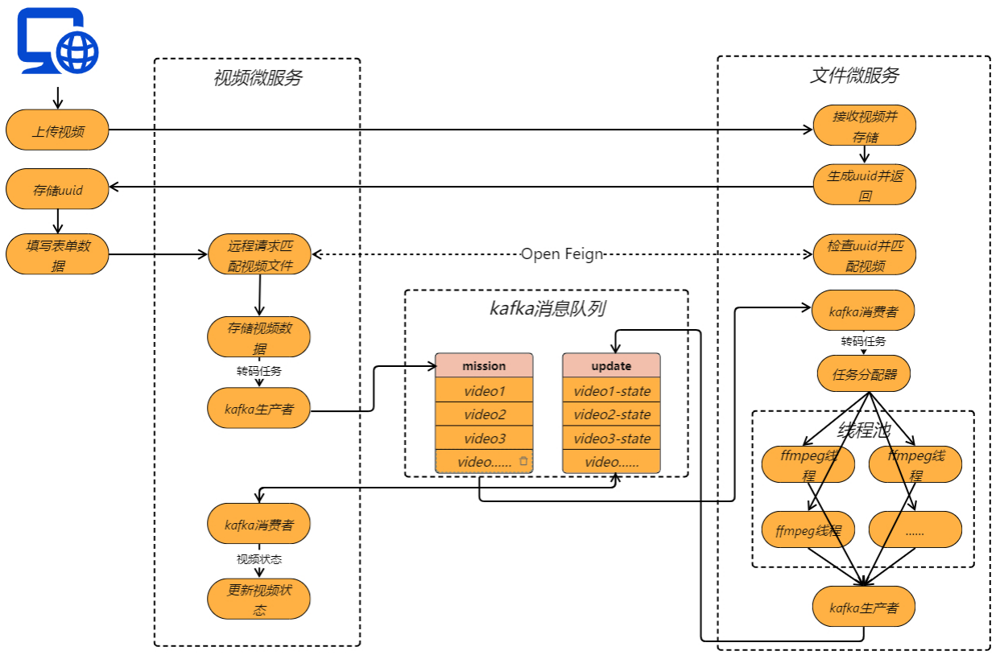
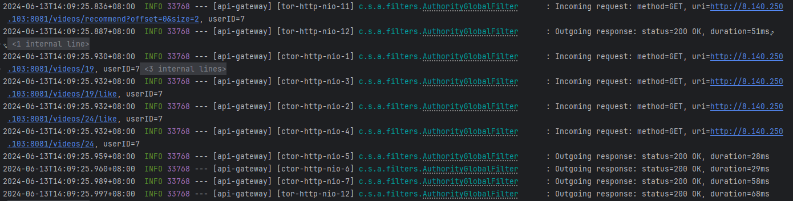

# 引言

本项目旨在开发一个简易版的短视频流推荐系统，类似于抖音。系统包括前端页面、后端服务功能、后台功能设计，用户可以通过该系统登录、发布和管理视频，并浏览推荐的视频内容。

# 系统架构

## 架构概览

系统整体采用微服务架构，网关接收来自前端的用户请求，认证通过后根据url将请求转发到对应业务服务器进行计算处理。此外，系统通过redis存储数据缓存以提高响应速度，通过kafka消息队列进行异步请求调用，使用openfeign进行服务间的远程调用。

 ## 技术栈

- 前端：vue3

- 后端：Spring Cloud

- 网关：Spring Cloud Gateway

- 服务注册发现：Zookeeper

- 安全：Spring Security

- 数据库：MySql

- 缓存：Redis

- 消息队列：Kafka

- 日志收集：Slf4j

- 远程调用：Open Feign

# 模块设计

## 视频上传与发布流程

- 前端将文件上传至文件服务器

- 文件服务器为视频文件生成唯一uuid并返回前端

- 前端保存uuid并在发布视频时将其与视频信息一同上传

- 视频微服务通过远程调用检查uuid合法性

- 检查无误后将视频信息存储到数据库并向kafka的mission话题中发送转码任务

- 文件微服务监听mission话题，将任务分配给线程池中的一个线程去处理，处理完成后将视频状态发送至update话题

- 视频微服务监听update话题，更新数据库中的视频状态

## 日志与监控模块

设计日志记录系统和监控系统，监测请求接口响应时间，记录响应结果，确保系统运行的可观测性和可维护性。

**工具使用：**Slf4j

**实现方式：**在网关中设置拦截器，记录响应前后的时间差，计算响应时间，并通过Slf4j记录请求与响应的日志信息。

# 接口设计

## RESTful API设计

系统整体采用Restful风格的API设计，每个URL对应唯一资源，每种前缀对应一种类型资源：

- /auth/** ：用户认证

- /user/** ：用户资源

- /file/** ：文件资源

- /videos/** ：视频资源

## 接口安全

为了确保系统的安全性，所有接口都需要进行权限控制和安全保护。具体措施包括使用JWT进行用户认证和授权，以及保护数据的传输和存储安全。

### 使用JWT进行用户认证和授权

JWT（JSON Web Token）是一种基于Token的认证机制，通过在请求头中携带Token来进行用户认证和授权。JWT的使用步骤如下：

- 用户在登录时通过用户名和密码获取JWT。

- 前端将JWT存储在本地存储或Cookie中。

- 在每次发送请求时，将JWT放在请求头的token字段中。

- 网关在接收到请求后，解析并验证JWT的有效性。

- 如果JWT有效，允许用户进行相应的操作；否则返回401 Unauthorized状态码。

### 保护敏感数据

为了保护敏感数据，系统在数据存储过程中对数据库中的敏感数据进行加密存储，例如用户密码。使用了Spring Security 中的BCryptPasswordEncoder进行加密来保护数据的安全。

### 接口限流

使用Spring Cloud Gateway自带的限流工具，通过令牌桶算法，对不同ip的访问进行限流，阻止爬虫用户与恶意请求攻击。

# 性能优化与扩展

## webflux响应式框架

视频微服务整体采用了webflux这种非阻塞式的框架以提高并发量：

- **非阻塞 I/O**：WebFlux 使用非阻塞 I/O，这意味着在处理请求时，不需要等待 I/O 操作完成，而是可以在 I/O 操作完成后收到通知。这大大提高了系统的吞吐量和响应速度。

- **高并发性**：由于其非阻塞的特性，WebFlux 可以更高效地处理大量并发请求，适合于高并发的应用场景，如视频点赞，视频信息获取等。

## kafka消息队列+线程池

视频上传模块通过kafka消息队列实现了异步式请求，生产者在发送消息后无需等待消费者处理完毕，从而***降低了延迟***。同时通过对线程池的使用，控制了高计算量任务的并发数量以***减少cpu负荷***，防止因cpu占用过大导致其他请求的响应时间增加。

## Redis缓存

系统采用了redis对数据进行缓存，显著提高了系统的性能和响应速度：

- **低延迟**：由于 Redis 完全在内存中操作，因此读取和写入操作非常快，通常可以在微秒级别完成。

- **高吞吐量**：Redis 可以处理大量的并发请求，适用于高负载的应用场景。

- **会话存储**：使用redis用来存储用户会话信息，提高 Web 应用的响应速度和用户体验。
